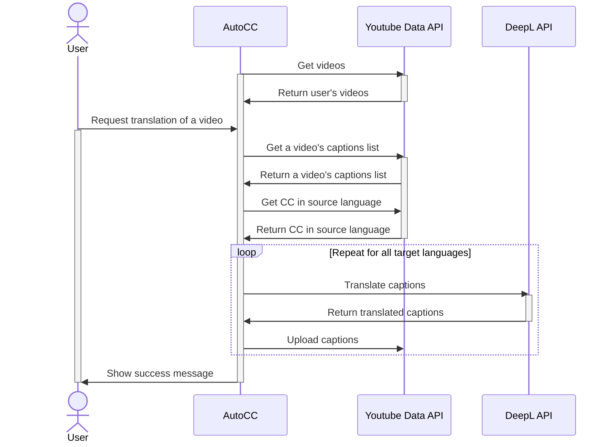
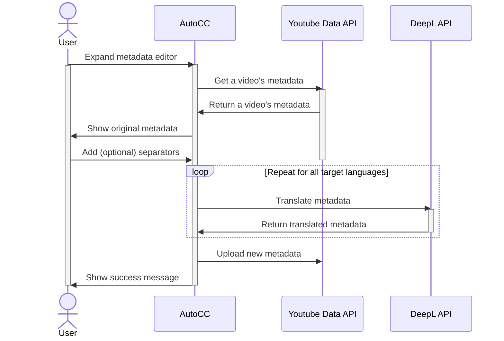
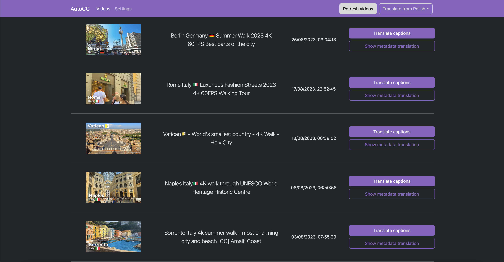
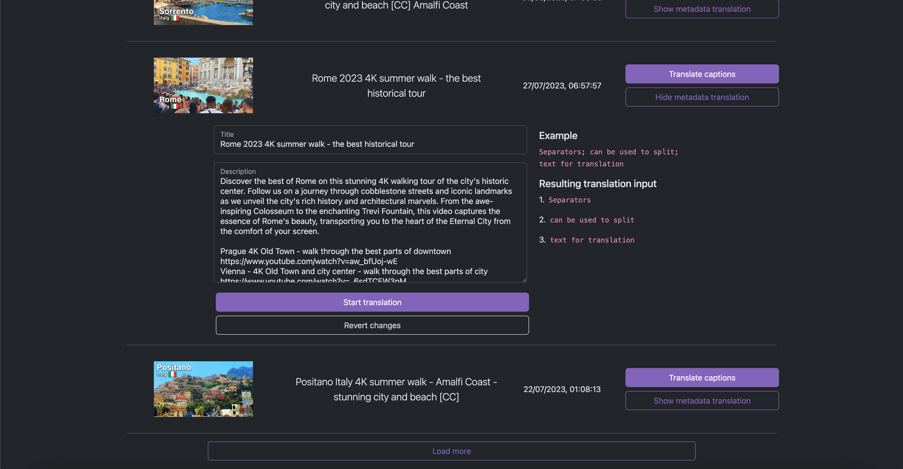

# AutoCC

**AutoCC** *(Automatic Closed Captions)* works by utilizing Youtube Data API and DeepL API

## About

Google Translate which is the translation service used by YouTube is known to be inaccurate. This is why I decided to create this project.
DeepL's translations are much more natural sounding which makes them perfect for reaching a wider audience.

Unfortunately, YouTube's API quota is very limited and any increases have to manually requested and approved by Google. This is why AutoCC is not publicly hosted.
You can of course run it yourself and provide your own API keys. 

**AutoCC supports API credentials rotation with the purpose of overcoming Google's strict limits.**

## Tech stack
- Go
- TypeScript (SvelteKit)
- Redis
- Docker

## Action flow (simplified)

### Closed Captions translation

### Metadata translation

## How to run

### Prerequisites

- Docker
- Google and DeepL API credentials

### Steps

0. Enable YouTube Data API v3 if you haven't done so already
1. Clone this repository
2. Create a `.env` file with:
- `REDIS_URL` - Your Redis URL (e.g. `redis://redis:6379` if you're using this project's docker-compose file)
- `GOOGLE_REDIRECT_URI` - Your API address followed by the callback endpoint path (e.g. `http://localhost:3001/youtube/callback`)
- `DEEPL_API_KEY` - Your DeepL API key
- `PORT` - Port to serve the API on
- `API_URL` - The app connects to the backend using this address

3. Run `docker compose up -d`
4. Open `localhost:3000` in your browser

## License

This project is licensed under the GNU v3 License - see the [LICENSE](LICENSE) file for details

## Screenshots

### Main page

### Metadata translation

